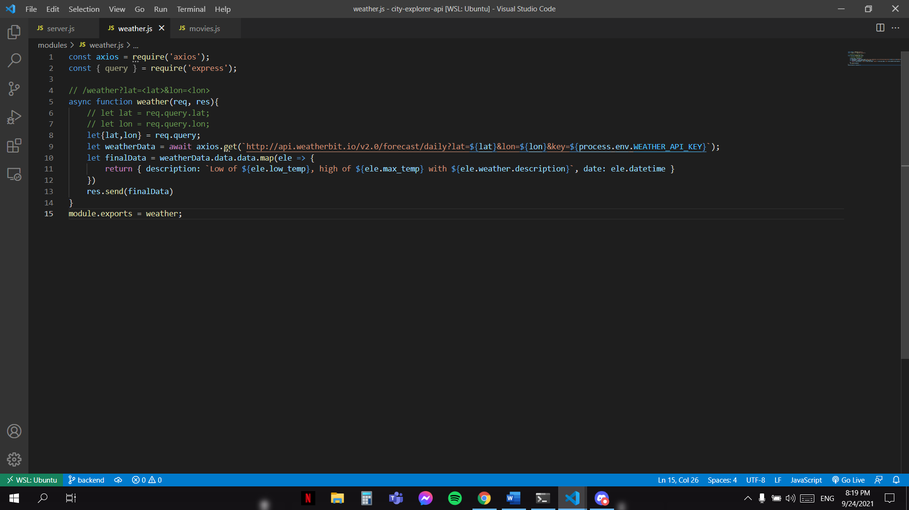

# Testing of the application

## White box

First of all, check that we import all of the things that we want. Then prioritize the code and test if it work.

---

When we test that the API, it's working.

---

In those two images we Modularize the files to let it easy to debug and read the code.

---

Testing that the API send method works and the json format works perfectly.

---

We tested it to verify flow of input-output and to improve design, in white box testing, code is visible to us to test everything, so we tested everything and everything is working good.